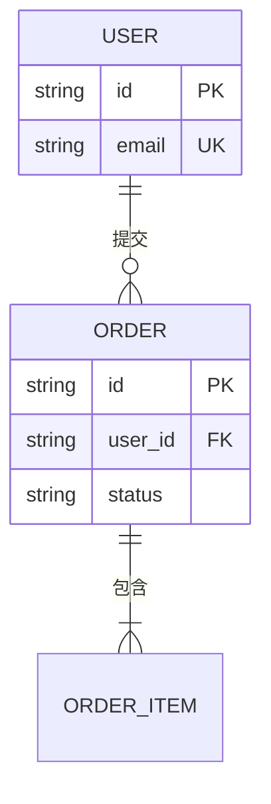
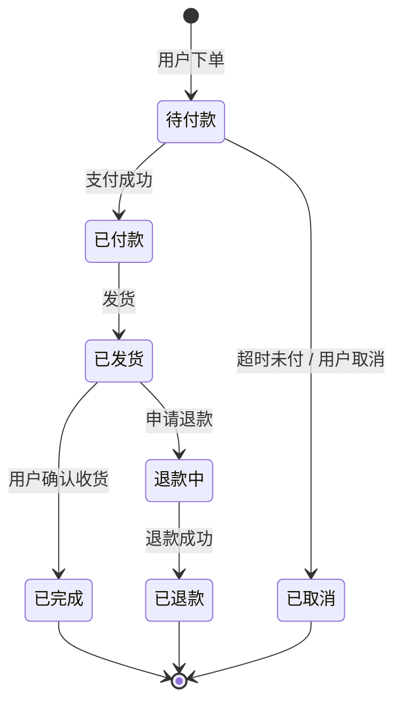

# CONTEXT.md

> **本文件是多 agent 协作的"意图契约"。** 它存在的理由：自然语言的聊天记录**无法被机器验证**，
> 而你要靠对齐意图来决定后面几百次改动。所以**意图必须落成可检查的结构**。
>
> ⚠️ **硬规矩：下面三张图 + 接口契约没写完，不许进入 Builder 阶段。**
> 校验命令（CI 可用）：
> ```powershell
> node scripts/verify-structure.mjs -Project .        # 退出码 1 = 不许开工
> ```
>
> **为什么值这个成本**：这三张图逼你在**写代码之前**发现"这个状态没有出口""这个实体没人引用"
> "这个端点没有错误处理"——**这三样都是 Builder 阶段最贵的返工源**。
>
> 🚫 **别把这份模板原样提交当 CONTEXT.md。** 它带着示例实体（`USER` / `ORDER`）、示例状态机、
> 一个带完整错误行的示例端点 —— 也就是说，**一份没填过的模板本身就能过校验**。
> 所以校验器现在会专门拦这一类：**模板占位符**（形如 `<!-- 例：… -->`）和**整行空着的表格行**
> 都会被判 FAIL（实测：这份文件提交上去会报 **11 处占位符 + 2 行空表**）。
> 闸门问的是"**你**想清楚了吗"，不是"模板里有没有示例"。
> 判据刻意收紧过：**说明性注释不算占位符**（`tests/fixtures/tiny-CONTEXT.md` 第 3 行那种），
> 只有 `例：` / `TODO` / `xxx` 这类才触发 —— 否则合规样例会被误杀。

---

## 一、统一语言（术语表）

**先定词，再画图。** 图上的名字必须与这里一致——否则图会变成新的行话。

| 术语 | 含义 | 不要叫 |
|---|---|---|
| <!-- 例：订单 --> | <!-- 例：用户提交的一次购买意图 --> | <!-- 例：交易 / 单子 / order --> |
|  |  |  |

> **判据**：一个词只能有一个意思。如果一个词能干三件事（如 "account"），拆开它。

---

## 二、实体关系图（ER）

**画图的规矩**：
- 实体名用**单数**（`ORDER` 不是 `ORDERS`）
- 每个实体必须**至少被一条关系连到**——孤岛实体 = 你还没想清它属于谁
- 关系要写**基数**（`||--o{`）和**动词**（"一个用户提交多个订单"）



---

## 三、状态流转图（核心对象的状态机）

**选一个核心对象**（订单 / 订阅 / 工单 / 会话——你系统里"会随时间变状态"的那个），画它的状态机。

**画图的规矩（这些会被机器检查）**：
- 每个状态**必须有出口**——**不许有死状态**（除了明确的终态 `[*]`）
- 每条迁移要写**触发条件**（什么事件导致这次迁移）
- 状态名要能对应到数据库里的一个值



> **自查**：把每个状态走一遍——**有没有哪个状态进了就出不来，而这又不是你的本意？**
> 这是最容易在代码里变成"卡死的订单"的地方。

---

## 四、接口契约

**每个端点**（API / 函数入口 / 命令行）写清三件事：**请求、响应、错误**。

> **不写"错误"是最常见的漏项**——于是 Builder 只好自己猜失败时怎么办，
> 而它猜的通常是"静默返回空"。这正是本体系反复禁止的反模式。

> **四条照着抄就不会卡在闸门上的经验**（首次真实跑通后记的）：
> 1. **本节开头不要写"共 N 个端点"这类汇总** —— 校验器按小标题切"端点块"，
>    段首的铺垫会被当成一个没写错误处理的端点。汇总写到「范围与口径」那种地方去。
> 2. **错误行加粗不加粗都行**（`| **错误** |` = `| 错误 |`）。
> 3. **不是每个端点都有错误分支**：静态资源、固定 HTML 页如实写"无错误分支（静态资源）"，
>    **别为了过闸门编一行假错误**——校验看的是你有没有回答这个问题。
> 4. **接口不止 HTTP**：WebSocket / 事件 / 消息协议同样是契约，
>    把它们的**上下行消息表**放进对应端点的条目里（列全类型），别只写一句"WS /ws"。

### 端点：`POST /api/<资源>`

| 项 | 内容 |
|---|---|
| **谁可以调** | <!-- 例：已登录用户，且只能操作自己的资源 --> |
| **请求** | `{ "字段": "类型与约束" }` |
| **成功响应** | `200 { "id": "...", ... }` |
| **错误** | `400 校验失败（哪个字段）` · `401 未登录` · `403 无权访问该资源` · `404 不存在` · `409 冲突` · `429 超限` · `500` |
| **幂等** | <!-- 写操作必须回答：重复提交会怎样？用什么做幂等键？ --> |

### 端点：`<下一个>`

| 项 | 内容 |
|---|---|
| **谁可以调** |  |
| **请求** |  |
| **成功响应** |  |
| **错误** |  |
| **幂等** |  |

---

## 五、范围边界（**明确写出"不做什么"**）

一个人做项目的生命线。**写出来才不会在 Builder 阶段偷偷膨胀。**

- **不做**：<!-- 例：多租户、团队协作、移动端、离线模式 -->
- **以后可能做**：<!-- 记在这里 = 现在坚决不做 -->
- **明确砍掉的**：<!-- 为什么砍，避免以后再讨论一遍 -->

---

## 六、不可逆决策（ADR 摘要）

难以逆转的决策**必须**落 `docs/adr/`，这里只放一行摘要与链接。

| 决策 | 为什么 | ADR |
|---|---|---|
| <!-- 例：用托管 Postgres --> | <!-- 例：一个人维护，备份/升级不占我时间 --> | `docs/adr/0001-*.md` |

---

## 七、待确认（**用户不在线时，假设落在这里**）

> **为什么有这一节**：铁律 2 说"含糊就先问用户、不许猜"，但用户常常不在线。
> 入口文档《从这里开始.md》第四节五给了三档降级规则，其中"决策类问题可以带假设往前走"
> **要求每条假设落文件**——这一节就是那个"落文件"的地方。
>
> ⚠️ **能写进这张表 ≠ 可以做。** 本表只降级铁律 2（不许猜意图），
> **不改变铁律 1**：动代码/配置、发布、花钱、删数据，无论假设多合理都要等用户点头。
> 表格没有"已确认"这一列是有意的：**假设在用户回来之前，状态永远是"待确认"。**

| # | 我假设了什么 | 依据（为什么这么猜） | 影响面（错了要改多大） | 状态 |
|---|---|---|---|---|
| 1 | <!-- 例：先只做单用户，不做多租户 --> | <!-- 例：需求里没提协作；范围边界那节写了"不做" --> | <!-- 例：小——不改数据结构 --> | 待确认 |
| 2 |  |  |  | 待确认 |

> **自查**：每条假设都问三句——① 它是不是**成本可控**（改起来便宜）？② 它会不会**越过闸门**？
> ③ 用户回来看到这一行，**30 秒能不能裁定**？三句有一句答不上来，就别往前走了。

---

## 附：这份文件怎么维护

- **改了实体/状态/契约 → 同步改本文件**，再跑一次 `verify-structure.mjs`。
- **图不要画成"理想设计"**——画你**真正要做**的那个。图与代码不符时，改图或改代码，**别让两者分叉**。
- 本文件**不是文档，是契约**。它的读者是下一个 agent 窗口，不是未来的你。
