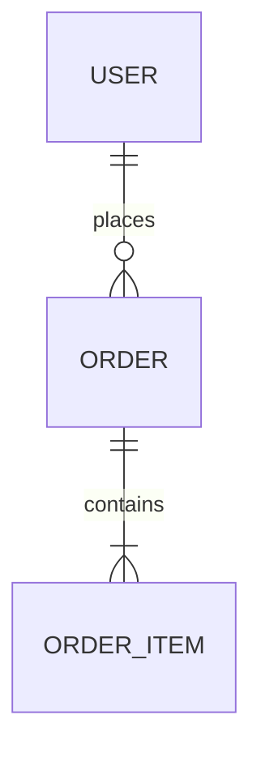
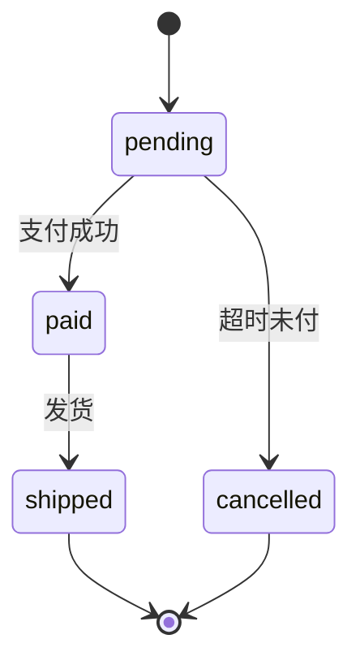

# CONTEXT.md（自检样例：一个**最小但合规**的文档）

<!-- 用途：给 scripts/self-test.mjs 当"正例"。它必须能通过 verify-structure.mjs。
     自检会在这份文件上注入错误（删错误行、加死状态），确认校验器真的会拦下来。
     改动这份文件时：必须同时让 self-test.mjs 的正例仍然通过。 -->

## 一、实体关系图

## 二、状态流转图

## 三、接口契约

### 端点：`POST /api/orders`

| 项 | 内容 |
|---|---|
| 谁可以调 | 已登录用户，且只能给自己下单 |
| 请求 | `{ "sku": "string", "qty": 1 }` |
| 成功响应 | `201 { "id": "ord_...", "status": "pending" }` |
| 错误 | `400 校验失败（sku/qty）` · `401 未登录` · `409 库存不足` · `429 超限` |
| 幂等 | 带 `Idempotency-Key` 时重复提交返回同一张单 |

## 四、范围边界

- **不做**：多币种、发票开具、退款自动化、库存跨仓调拨。
- 这些留给"以后有人真的要"的时候再说。
